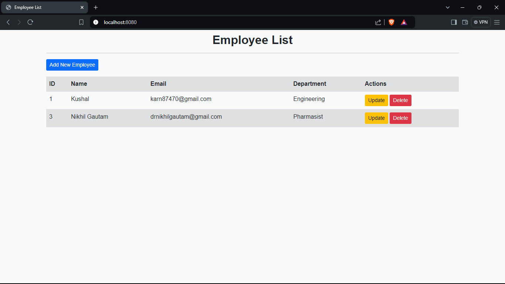
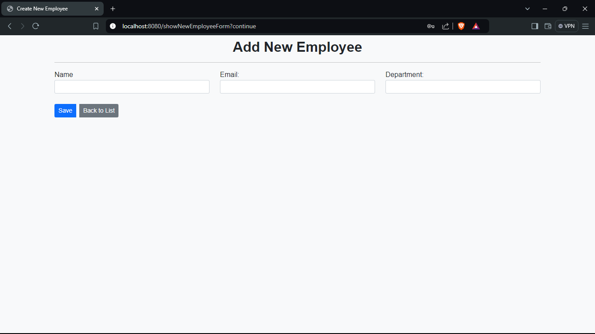
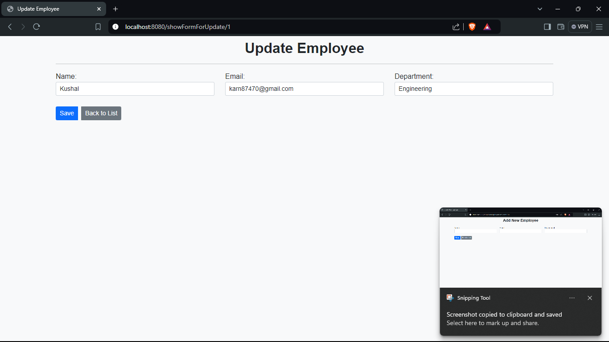

# Employee Management System

## Description

The **Employee Management System** is a full-stack web application developed using **Spring Boot**, **Thymeleaf**, and **MySQL**. This application allows users to perform CRUD (Create, Read, Update, Delete) operations on employee records. It features user authentication and authorization using Spring Security, providing a secure environment for managing employee data.

## Features

- **User Authentication:** Secure login and registration for users.
- **Employee CRUD Operations:**
  - Create new employee records.
  - Retrieve and view employee details.
  - Update existing employee information.
  - Delete employee records.
- **Responsive Design:** User-friendly interface that works on various devices.
- **Data Persistence:** Employee information is stored in a MySQL database.

## Technologies Used

- **Backend:** Spring Boot, Spring Security, JPA (Hibernate)
- **Frontend:** Thymeleaf, HTML, CSS (Bootstrap 5)
- **Database:** MySQL
- **Development Tools:** Maven, Spring DevTools

## Installation

1. **Clone the repository:**

   ```bash
   git clone https://github.com/Kushalobroy/CRUD-Spring.git

2. **Navigate to the project directory:**

    ```bash
    cd CRUD-Spring

3. **Configure the application.properties file with your MySQL database details.**

4. **Run the application:**
    ```bash
    mvn spring-boot:run

5. **Access the application at http://localhost:8080.**

## Screenshots

### List of Employees


### Add New Employee


### Update Employee


